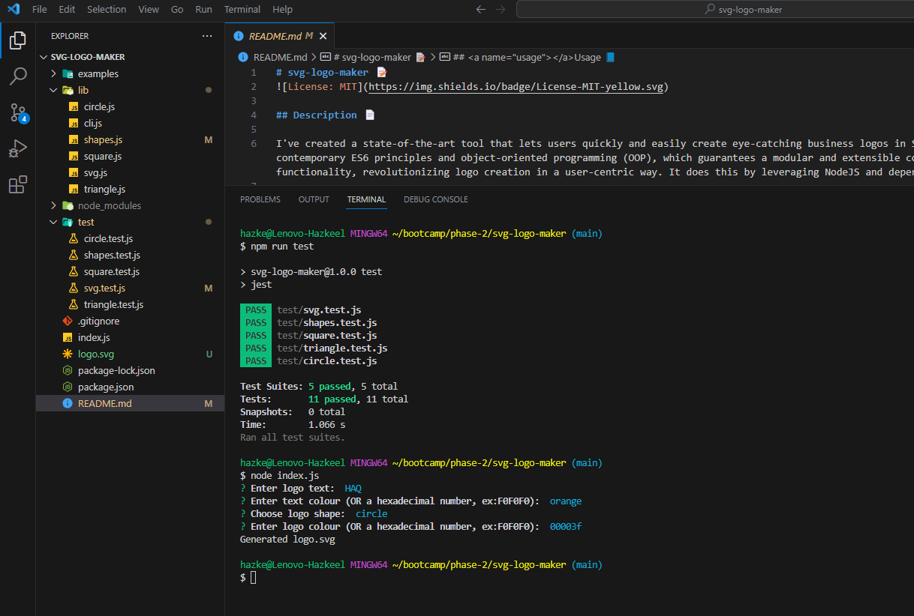
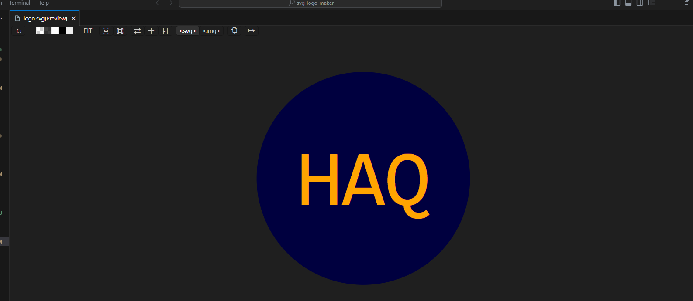

# svg-logo-maker 📝


## Description 📄

I've created a state-of-the-art tool that lets users quickly and easily create eye-catching business logos in SVG. This accomplishment is supported by a solid foundation of contemporary ES6 principles and object-oriented programming (OOP), which guarantees a modular and extensible codebase. The application smoothly integrates creativity with functionality, revolutionizing logo creation in a user-centric way. It does this by leveraging NodeJS and dependencies like inquirer for user input and jest for thorough testing.

## Table of Contents

* [Installation](#installation) 🛠️
* [Usage](#usage) 📘
* [Contributing](#contributing) 🤝
* [Tests](#tests) 🧪
* [License](#license) 📜
* [Credits](#credits) 🙏
* [Questions](#questions) ❓
* [Deployed Application](#link) 🚀

## <a name="installation"></a>Installation 🛠️

To install necessary dependencies, run the following command:

```
npm i
npm install inquirer@8.2.4
npm install jest@28.1.3 --save-dev
```

## <a name="usage"></a>Usage 📘

- The user must install Visual Studio Code to run the application.
- Then the user must install the NodeJS library.
- Install the inquirer dependency to ask questions in the terminal.
- Developers can install the jest devdependency to test the code.
- Answer questions asked in the terminal to generate a logo.svg file.

Following is the screenshot of the terminal with questions answered by user. 📷



Following is the generated logo.svg file. 📷



Following is a video demonstrating the how to run the application in the terminal as well as the application passing jest devdependency tests. 🎥

[](https://www.youtube.com/watch?v=nWNQEc4X2qo)

## <a name="contributing"></a>Contribution 🤝

Although the application makes use of modern ES6 ideas and object-oriented programming, its scope is currently constrained. By adding other features, such a wide variety of logos for clients to choose from easily, users can increase the functionality of the program.

## <a name="tests"></a>Tests 🧪

To run tests, run the following command:

```
node index.js
```

## <a name="license"></a>License 📜

This project is licensed under The MIT License. Here is the link to the license to access more information for your reference: [https://opensource.org/licenses/MIT](https://opensource.org/licenses/MIT)

## <a name="credits"></a>Credits 🙏

I utilized the study material provided by the institution as a reference to complete my application.

Following are the documents I used to help me write code:

- [https://en.wikipedia.org/wiki/SVG](https://en.wikipedia.org/wiki/SVG)
- [https://developer.mozilla.org/en-US/docs/Web/SVG/Tutorial](https://developer.mozilla.org/en-US/docs/Web/SVG/Tutorial)
- [https://developer.mozilla.org/en-US/docs/Web/SVG/Tutorial/Basic_Shapes](https://developer.mozilla.org/en-US/docs/Web/SVG/Tutorial/Basic_Shapes)
- [https://developer.mozilla.org/en-US/docs/Web/SVG/Tutorial/Texts](https://developer.mozilla.org/en-US/docs/Web/SVG/Tutorial/Texts)
- [https://marketplace.visualstudio.com/items?itemName=jock.svg](https://marketplace.visualstudio.com/items?itemName=jock.svg)

## <a name="questions"></a>Questions ❓

If you have further questions, you are welcome to reach me through my email at hazkeel27@gmail.com.

You can view my projects by going through my GitHub profile at [https://github.com/hazkeel27](https://github.com/hazkeel27).

## <a name="link"></a>Deployed Application 🚀

